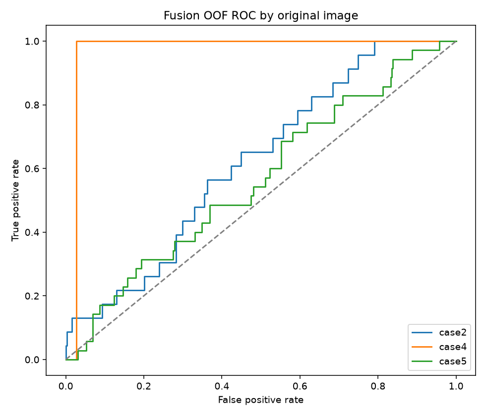

# CSIG 新方案工作区

**Public repository · Phase 0 complete**

本仓库公开原始方案、全部实验代码、指标和可视化。Phase 0 要求的 **patch、特征、模型、官方输出和完整日志** 全部放在同仓库 Release `phase0-2026-09-15`，不是仅有文档或示例。

- 完整下载与逐项交付表：`publication/README.md`
- GitHub 完整产物：[Phase 0 Release](https://github.com/Jay1106-Zhu/csig-hallucination-aware-restoration/releases/tag/phase0-2026-09-15)
- Release 清单与文件 SHA-256：`publication/artifact_manifest.json`、`publication/SHA256SUMS.txt`
- 下载并恢复完整实验目录：`python publication/download_artifacts.py --extract`

| 特征 | 原图宏平均 ROC-AUC |
|---|---:|
| CLIP | 0.6644 |
| DINOv2 | 0.7548 |
| Fusion | 0.7195 |

> 只有 5 张原图、59 个 GOOD patch；AUC 只在 3 张图上定义，且一张只有 1 个 GOOD。排除单正例场景后 Fusion AUC=0.5926。**不要把此探索结果当成可靠的 Gate 效果证明。**

## 可视化预览

全部 20 个失败对照、五组 gain/confidence 热图、场景概览和补充语义区域均在 `csig_phase0/reports/visualization/`，原尺寸浮点热图另在 Release 中。

本目录统一管理后续任务，当前只执行 **Phase 0：验证恢复可信度是否可预测**。

Phase 0 已于 2026-09-15 完成。Fusion AUC=0.7195 达到探索门槛，但仅三个有效 AUC 原图且一张只有一个 GOOD，实际推进建议 **HOLD：先补数据，不启动 Gate/专家训练**。

## 从哪里看
- 原始总体方案：`CSIG_Hallucination_Aware_Restoration_Strategy.md`（保留原文）。
- 原始 Phase 0 指导：`CSIG_Phase0_Experiment_Guide.md`（保留原文）。
- 当前计划、发现与执行日志：`task_plan.md`、`findings.md`、`progress.md`。
- Phase 0 交付入口：`csig_phase0/phase0_done.md`。
- 完整实验报告：`csig_phase0/reports/phase0_report.md`。
- 阶段说明和复现：`csig_phase0/README.md`。
- 后续任务：`NEXT_TASKS.md`，仅列规划，未经授权不自动执行。

## 归档约定

每个阶段独立建目录；不把新结果写入旧 `baseline/`、`reports/` 或项目根目录。原始数据和 HYPIR 默认只读。

| 目录 | 内容 |
|---|---|
| `csig_phase0/configs/` | 预先固定的参数 |
| `csig_phase0/data/` | 原始路径清单、输入副本、无损 patch 数组 |
| `csig_phase0/models/` | 冻结 CLIP/DINO 权重；不重复存放原始 HYPIR 大模型 |
| `csig_phase0/checkpoints/` | 原图留一各折 MLP 与全量拟合 checkpoint |
| `csig_phase0/outputs/` | 官方 HYPIR 原尺寸推理结果 |
| `csig_phase0/features/` | 特征数组、行顺序索引 |
| `csig_phase0/analysis/` | 逐图/逐 seed 指标、OOF、划分、哈希、审计 |
| `csig_phase0/scripts/`、`tests/` | 可复现代码与契约测试 |
| `csig_phase0/logs/` | 实际执行与验证日志 |
| `csig_phase0/reports/` | 协议、CSV、可视化、中文报告 |
| `csig_phase0/dependencies/` | 阶段专用补充依赖，不替换旧环境 |

后续阶段沿用同一结构，并先在 `task_plan.md` 登记范围、验收标准、状态和单一下一步。
